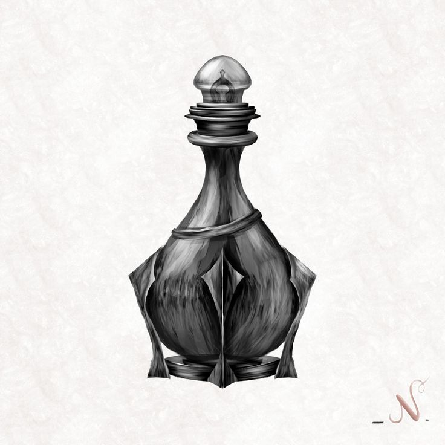

# [Potion of Elephant Feet](Potion%20of%20Elephant%20Feet.md)

## Rarity
Common
## Value
Gering
## Type
Potion
## Attunement
No
## Description
Eine schlichte Glasphiole mit einem einfachen Korken, gefüllt mit einer grauen Flüssigkeit. Beim Schütteln steigen feine Bläschen auf, die mit einem leisen Knacken zerplatzen. Der Trank riecht nach Harz, Kräutern und einem Hauch Schwefel.
Der ursprüngliche Trank wurde von [Quinn](../Spieler/Quinn.md) im Verhältnis **1:3 mit Wasser verdünnt**, wodurch aus einer Portion insgesamt **vier trinkbare Dosen** entstanden.
## Magical Properties

### Ohrenbetäubender Lärm
Nach dem Trinken erzeugt der Anwender für **30 Minuten** bei jeder Bewegung außergewöhnlich laute Geräusche. Jeder Schritt hallt nach, Kleidung raschelt übertrieben laut und selbst leise Bewegungen sind weithin hörbar.
Die Person, die den Trank getrunken hat, kann in dieser Zeit nicht schleichen.
### Abschreckende Wirkung
Der anhaltende Lärm schreckt viele kleine oder scheue Kreaturen ab. Solche Wesen meiden den Träger, sofern sie nicht bereits aggressiv oder magisch kontrolliert sind.
## Usage
- Der ursprüngliche Trank wurde in **4 Portionen** aufgeteilt.
- **1 Portion** wurde bereits verbraucht.
- **3 Portionen** verbleiben.
## Charges
3 Portionen
## Curses (optional)
Keine.
## History & Legends
Unbekannt. Wahrscheinlich handelt es sich um einen alchemistischen Fehlschlag, der sich überraschend als nützlich gegen kleinere Kreaturen erwies.