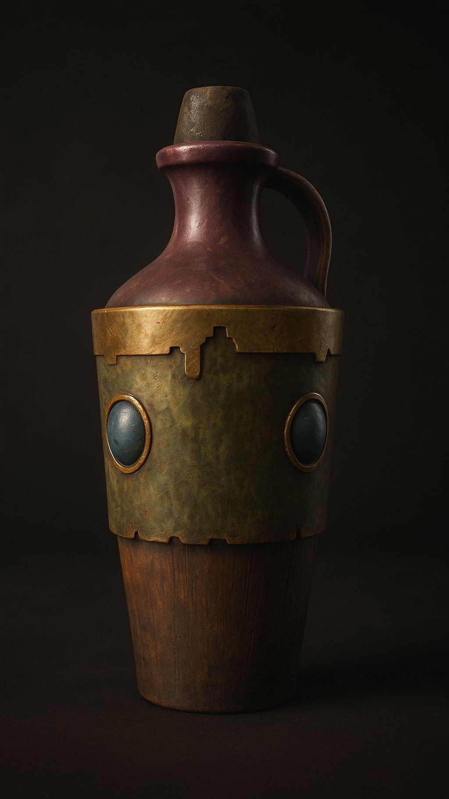

# [Skooma](Skooma.md)

> **Skooma** ist eine hochpotente alchemistische Droge, die kurzfristig enorme Kräfte verleiht, aber schnell abhängig macht.

| Seltenheit | Typ                         | Legalität |
| ---------- | --------------------------- | --------- |
| Rare       | Konsumierbares Rauschmittel | Illegal   |

## Konsum

| Nutzer            | Konsum    | Dauer   | Buffs                                                                                                                              | Nachteile                                                                                                                |
| ----------------- | --------- | ------- | ---------------------------------------------------------------------------------------------------------------------------------- | ------------------------------------------------------------------------------------------------------------------------ |
| **Nicht süchtig** | Schlucken | 60 Min. | Vorteil auf **Angriff** **ODER** **Rettungswürfe** (beim Konsum wählen) +2 Schaden +10 ft Bewegung Vorteil auf Initiative | **CON SG 13** Erfolg: normale Wirkung Fehlschlag: 1 Stunde **Vergiftet**, Nachteil auf alle Würfe, Halluzinationen |
| **Nicht süchtig** | Rauchen   | Sofort  | Keine                                                                                                                              | CON SG 13 oder 10 Minuten Halluzinationen. Kann abhängig machen (SL).                                                    |
| **Süchtig**       | Schlucken | 10 Min. | Vorteil auf **Angriff** **ODER** **Rettungswürfe** +2 Schaden +10 ft Bewegung Vorteil auf Initiative                      | Nach Ablauf: **CON SG 13** Erfolg: 2 Stunden **Stumm** Fehlschlag: zusätzlich **1 Stufe Erschöpfung**              |
| **Süchtig**       | Rauchen   | Sofort  | Entfernt **1 Stufe Erschöpfung** (max. 1×/Tag)                                                                                     | Keine Kampfbuffs. Setzt den Entzug zurück.                                                                               |

## Kampfrausch

| Effekt | Beschreibung |
|---------|--------------|
| Initiative | Vorteil |
| Bonusaktion | 1× pro Kampf: zusätzlicher Angriff **oder** Dash |
| Wahrnehmung | Nachteil auf Perception & Insight |
| Kontrollverlust | Natürliche 1 auf Angriff → 1d6 Selbstschaden |

## Entzug

| Zeitpunkt | Rettungswurf | Fehlschlag |
|------------|--------------|------------|
| 24h ohne Konsum | CON SG 12 (+1 pro weiterem Tag) | 1 Stufe Erschöpfung |

## Langzeitfolgen

Nach jeweils **10 konsumierten Dosen** würfle **1W6**.

| W6 | Folge |
|:--:|-------|
| 1 | Permanentes -1 CON |
| 2 | Permanentes -1 WIS |
| 3 | Keine Vorteile eines Long Rest bis 24h clean |
| 4 | Paranoia |
| 5 | Nachteil auf Stealth |
| 6 | Keine Auswirkungen |

## Preis & Verfügbarkeit

| Preis | Verfügbarkeit |
|--------|---------------|
| 25–100 GP pro Dosis | Meist nur über Schwarzmärkte erhältlich |

## Reines Skooma *(Legendär)*

Reines Skooma ist zu stark für Nicht-Süchtige. Nicht-Süchtige sterben beim Versuch reines Skooma zu konsumieren.

| Effekt         | Beschreibung          |
| -------------- | --------------------- |
| Dauer          | 20 Minuten            |
| Nebenwirkungen | Keine Erschöpfung     |
| Buffs          | Alle Buffs verdoppelt |
| Seltenheit     | Extrem selten         |