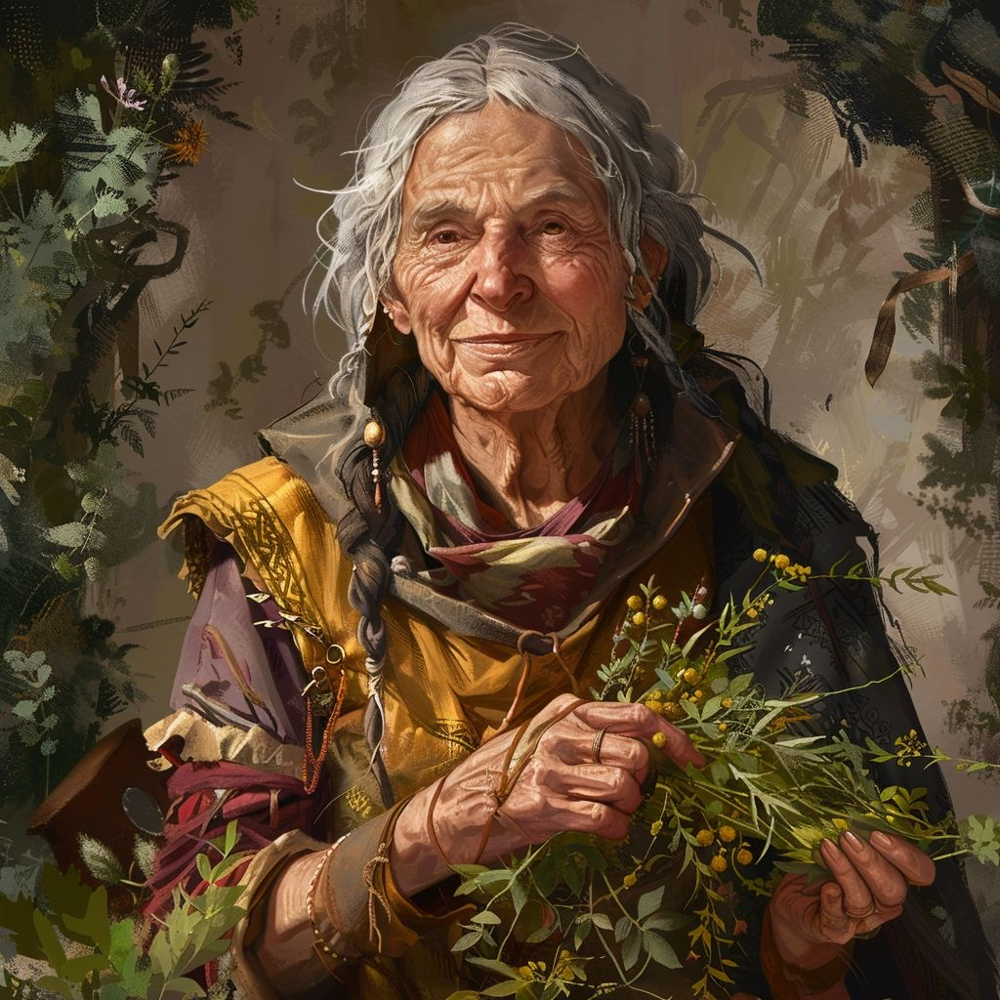

# [Mary](Kiribati/Länder/Kharotai/Städte/Eisenhütte/Händler/Mary.md)

## Beruf
Trankbrauerin und Alchemistin
## Wohnort
[Eisenhütte](../Kiribati/Länder/Kharotai/Städte/Eisenhütte/Eisenhütte.md)
## Rasse
Mensch
## Alter
82
## Gesinnung
lawful good
## Beziehungen
## Persönlichkeit
Mary ist außergewöhnlich neugierig und aufgeschlossen. Sie liebt Geschichten aus aller Welt und hört ihren Gästen aufmerksam zu. Klatsch und Tratsch sammelt sie ebenso begeistert wie seltene Kräuter und Ingredenzien.
## Verhalten
Sie begrüßt Fremde herzlich und bietet ihnen meist sofort einen Tee oder einen kleinen Schnaps zum Probieren an. Gespräche mit ihr fühlen sich wie ein Plausch unter Freunden an.
## Tagesablauf

| Uhrzeit | Ort               | Tätigkeit                             |
| ------- | ----------------- | ------------------------------------- |
| 07:00   | Alchemielabor     | Tränke brauen                         |
| 10:00   | Laden             | Kunden bedienen                       |
| 14:00   | Umgebung          | Kräuter sammeln                       |
| 18:00   | Zum ersten Hammer | Unterhält sich mit den Gästen         |
| 22:00   | Zuhause           | Schreibt Notizen über neue Rezepturen |
